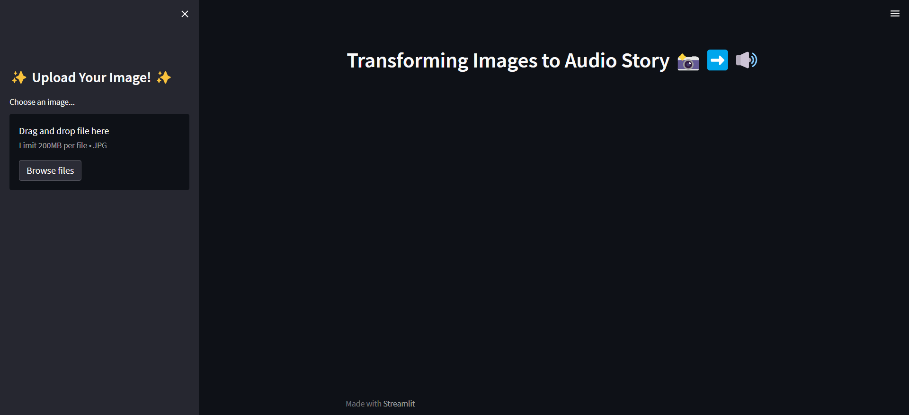

# Image to Audio Story Generator
 
Turn images into captivating audio stories with just a click! This innovative project combines image analysis, natural language generation, and text-to-speech conversion to create audio stories from uploaded images.
 
The Image to Audio Story Generator is a Streamlit-based web application that leverages cutting-edge technologies to transform images into engaging audio narratives. This project aims to bring creativity and storytelling to a whole new level by automatically generating stories based on the content of uploaded images.

## Features

- **Image-to-Text Conversion**: Utilizes the Salesforce/blip-image-captioning-base model to extract text content from images.
- **AI-Generated Stories**: Employs the OpenAI GPT-3.5 Turbo model to generate creative and unique short stories based on the extracted text.
- **Text-to-Speech**: Converts the generated story into an audio file (MP3) using gTTS (Google Text-to-Speech).
- **User-Friendly Interface**: A user-friendly web interface built with Streamlit for easy image upload and story presentation.
 
